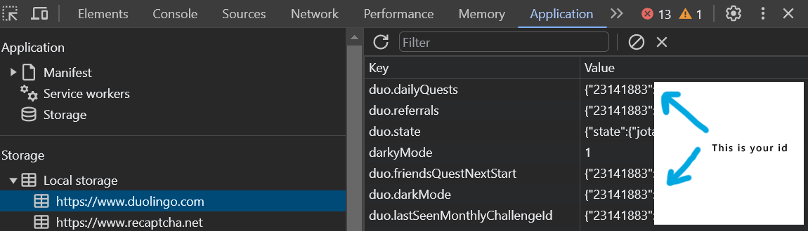

<!-- PROJECT LOGO -->
 

  

  <h3 align="center">Duolingo Stats Card</h3>

  

    🦉 Duolingo Stats Card that you can embed in README files ✨
     
    <a href="https://duolingo-stats-card.vercel.app/">✨ View Demo</a>
    ·
    <a href="https://github.com/KevzPeter/duolingo-stats-card/issues">🐛 Report Bug</a>
    ·
    <a href="https://github.com/KevzPeter/duolingo-stats-card/issues">💁🏽 Request Feature</a>
  

## ⭐ Add to your README page ⭐
 

Add the following line to your Github README.md page and replace {your-duolingo-id} ⤵️

``
 
 Or even this way ⤵️

``

For example, if your Duolingo id is "23141883", add the following line:

``
 

### 💡 Wait! How do I get my Duolingo id ?

1. Login at [duolingo.com](duolingo.com)
2. Go to Developer Tools in your browser (hit F12 key)
3. Go to Application tab ➡️ Local Storage ➡️ duolingo.com
4. The number that you see here 👇🏽 repeated multiple times is your Duolingo profile id

   

## 🎨 THEMES 🎨

Want to spice up the look and feel of your stats card?
You can choose your favorite among 15 different themes!

- light (default)
- dark
- github-dark
- monokai
- tokyonight
- nightowl
- onedark
- shades-of-purple
- dracula
- cobalt2
- sky
- beach
- purple-gang
- mint
- leafy

Simply add the *theme* parameter to the url like so:

``

| | | |
| :--: | :--: | :--: |
| `light` ![light][light] | `dark` ![dark][dark] | `github-dark` ![github-dark][github-dark] |
| `monokai` ![monokai][monokai] | `tokyonight` ![tokyonight][tokyonight] | `nightowl` ![nightowl][nightowl] |
| `onedark` ![onedark][onedark] | `shades-of-purple` ![shades-of-purple][shades-of-purple] | `dracula` ![dracula][dracula] |
| `cobalt2` ![cobalt2][cobalt2] | `sky` ![sky][sky] | `beach` ![beach][beach] |
| `purple-gang` ![purple-gang][purple-gang] | `mint` ![mint][mint] | `leafy` ![leafy][leafy] |

[light]: https://duolingo-stats-card.vercel.app/api?id=23141883&theme=light
[dark]: https://duolingo-stats-card.vercel.app/api?id=23141883&theme=dark
[github-dark]: https://duolingo-stats-card.vercel.app/api?id=23141883&theme=github-dark
[monokai]: https://duolingo-stats-card.vercel.app/api?id=23141883&theme=monokai
[tokyonight]: https://duolingo-stats-card.vercel.app/api?id=23141883&theme=tokyonight
[nightowl]: https://duolingo-stats-card.vercel.app/api?id=23141883&theme=nightowl
[onedark]: https://duolingo-stats-card.vercel.app/api?id=23141883&theme=onedark
[shades-of-purple]: https://duolingo-stats-card.vercel.app/api?id=23141883&theme=shades-of-purple
[dracula]: https://duolingo-stats-card.vercel.app/api?id=23141883&theme=dracula
[cobalt2]: https://duolingo-stats-card.vercel.app/api?id=23141883&theme=cobalt2
[sky]: https://duolingo-stats-card.vercel.app/api?id=23141883&theme=sky
[beach]: https://duolingo-stats-card.vercel.app/api?id=23141883&theme=beach
[purple-gang]: https://duolingo-stats-card.vercel.app/api?id=23141883&theme=purple-gang
[mint]: https://duolingo-stats-card.vercel.app/api?id=23141883&theme=mint
[leafy]: https://duolingo-stats-card.vercel.app/api?id=23141883&theme=leafy

 

<!-- BUILT WITH -->
## 🔧 Built With 🔧
 

* [![Next][Next.js]][Next-url]
* [![React][React.js]][React-url]

<!-- SET UP -->
## 🏗️ Set Up your own Server 🏗️

* Make sure you have Node.js installed
* Clone the repository
* Run *npm i* in the root directory
* Run *npm run dev* to make sure everything's working fine
* Replace BASEURL in *utils/config.ts* to the deployment url of your choice 
* Deploy to Vercel with the same deployment url
* Head over to https://{your-vercel-deployment-url}/api?id={your-duoling-id} to view the results
* Oh, and make sure to update the links in your README file as well :P

 

<!-- CONTRIBUTING -->
## 🙌🏼 Contributing 🙌🏼

If you wanna add your custom theme or suggest enhancements, please fork the repo and create a pull request. You can also simply open an issue with the tag "enhancement".
Don't forget to give the project a star! Thanks again!

1. Fork the Project
2. Create your Feature Branch (`git checkout -b feature/AmazingFeature`)
3. Commit your Changes (`git commit -m 'Add some AmazingFeature'`)
4. Push to the Branch (`git push origin feature/AmazingFeature`)
5. Open a Pull Request

(<a href="#readme-top">back to top</a>)

<!-- MARKDOWN LINKS & IMAGES -->
<!-- https://www.markdownguide.org/basic-syntax/#reference-style-links -->
[contributors-shield]: https://img.shields.io/github/contributors/othneildrew/Best-README-Template.svg?style=for-the-badge
[contributors-url]: https://github.com/othneildrew/Best-README-Template/graphs/contributors
[forks-shield]: https://img.shields.io/github/forks/othneildrew/Best-README-Template.svg?style=for-the-badge
[forks-url]: https://github.com/othneildrew/Best-README-Template/network/members
[stars-shield]: https://img.shields.io/github/stars/othneildrew/Best-README-Template.svg?style=for-the-badge
[stars-url]: https://github.com/othneildrew/Best-README-Template/stargazers
[issues-shield]: https://img.shields.io/github/issues/othneildrew/Best-README-Template.svg?style=for-the-badge
[issues-url]: https://github.com/othneildrew/Best-README-Template/issues
[license-shield]: https://img.shields.io/github/license/othneildrew/Best-README-Template.svg?style=for-the-badge
[license-url]: https://github.com/othneildrew/Best-README-Template/blob/master/LICENSE.txt
[linkedin-shield]: https://img.shields.io/badge/-LinkedIn-black.svg?style=for-the-badge&logo=linkedin&colorB=555
[linkedin-url]: https://linkedin.com/in/othneildrew
[product-screenshot]: images/screenshot.png
[Next.js]: https://img.shields.io/badge/next.js-000000?style=for-the-badge&logo=nextdotjs&logoColor=white
[Next-url]: https://nextjs.org/
[React.js]: https://img.shields.io/badge/React-20232A?style=for-the-badge&logo=react&logoColor=61DAFB
[React-url]: https://reactjs.org/
[Vue.js]: https://img.shields.io/badge/Vue.js-35495E?style=for-the-badge&logo=vuedotjs&logoColor=4FC08D
[Vue-url]: https://vuejs.org/
[Angular.io]: https://img.shields.io/badge/Angular-DD0031?style=for-the-badge&logo=angular&logoColor=white
[Angular-url]: https://angular.io/
